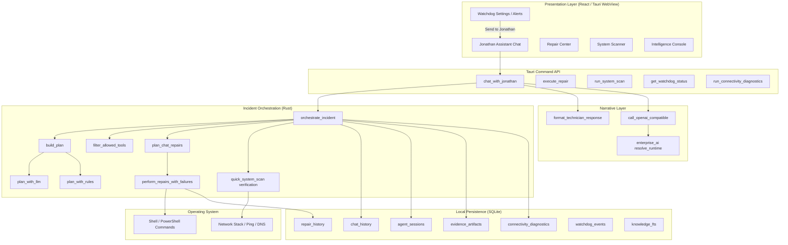
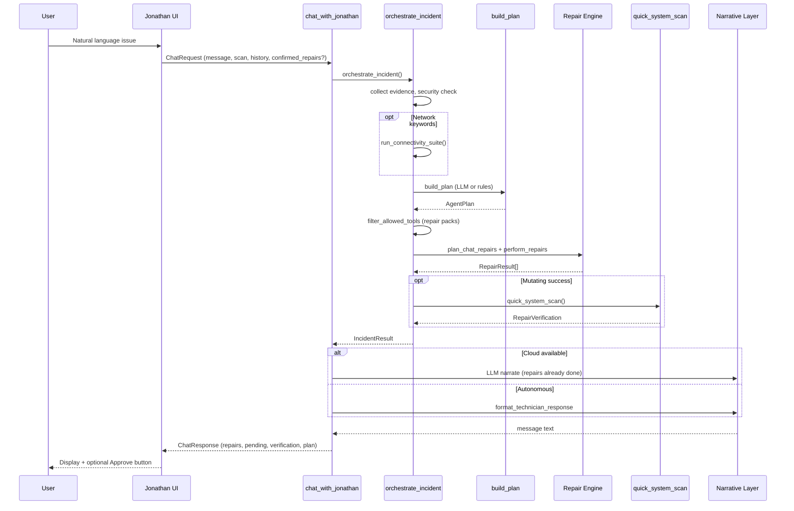
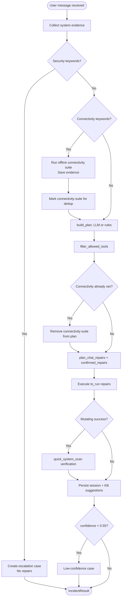
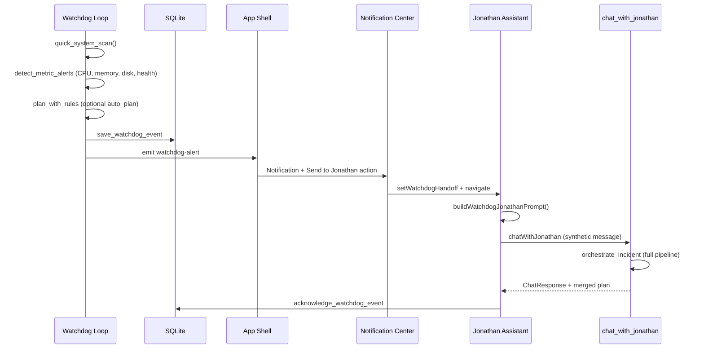
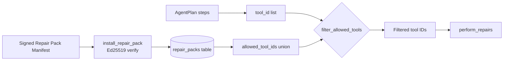

# System Architecture and Flows — Thorpe Desktop / Jonathan

**For:** Patent drawings and specification figures  
**Format:** Mermaid diagrams (attorney may convert to USPTO-compliant line drawings)

---

## Figure 1 — System architecture (block diagram)



---

## Figure 2 — Chat turn sequence (method steps)



---

## Figure 3 — Orchestration decision flowchart



---

## Figure 4 — Watchdog to Jonathan handoff



---

## Figure 5 — Repair pack gating



---

## Key data structures (for specification)

### ChatRequest

```
message: string
skill_level: string
scan_context: optional SystemScanResult JSON
history: ChatHistoryItem[]
confirmed_repairs: optional string[] (repair action IDs)
```

### AgentPlan

```
hypotheses: string[]
confidence: float (0.0–1.0)
steps: AgentPlanStep[]
citations: string[]
escalate_if: string[]
```

### AgentPlanStep

```
tool_id: string
reason: string
risk: string
requires_approval: boolean
```

### RepairResult

```
success: boolean
message: string
action_id: string
action_name: string
action_kind: diagnostic | mutating | advisory
record_id: string
```

### RepairVerification

```
health_before: int
health_after: int
issues_before: int
issues_after: int
improved: boolean
```

### ConnectivityReport

```
checks: ConnectivityCheck[]
overall_status: offline | degraded | healthy
recommended_actions: string[]
playbook_summary: string
offline_capable: true
```

### WatchdogEvent

```
id: string
event_type: health_threshold | high_cpu | high_memory | low_disk:{mount}
health_score: int
message: string
plan_json: optional AgentPlan JSON
issues_json: optional ScanIssue[] JSON
acknowledged: boolean
```

---

## Platform deployment

| Component | Technology |
|-----------|------------|
| Desktop shell | Tauri 2 (Rust + WebView) |
| Frontend | React 18, TypeScript |
| Backend | Rust (scanner, repairs, agent, AI) |
| Database | SQLite with FTS5 |
| Cloud AI | OpenAI-compatible HTTPS API (optional) |
| Targets | Windows 10/11, macOS Apple Silicon, Linux |

---

## Suggested patent figure captions

1. **FIG. 1** — Block diagram of Thorpe Desktop autonomous IT support system showing presentation layer, orchestration engine, narrative layer, local persistence, and operating system interface.

2. **FIG. 2** — Sequence diagram illustrating execute-then-narrate ordering wherein repair execution precedes AI narrative generation.

3. **FIG. 3** — Flowchart of incident orchestration including security gate, connectivity pre-run, planning, allowlist filtering, confirmation gate, execution, and verification.

4. **FIG. 4** — Sequence diagram of proactive watchdog alert handoff into conversational agent pipeline.

5. **FIG. 5** — Flowchart of cryptographically signed repair pack allowlist intersection with AI planner output.
